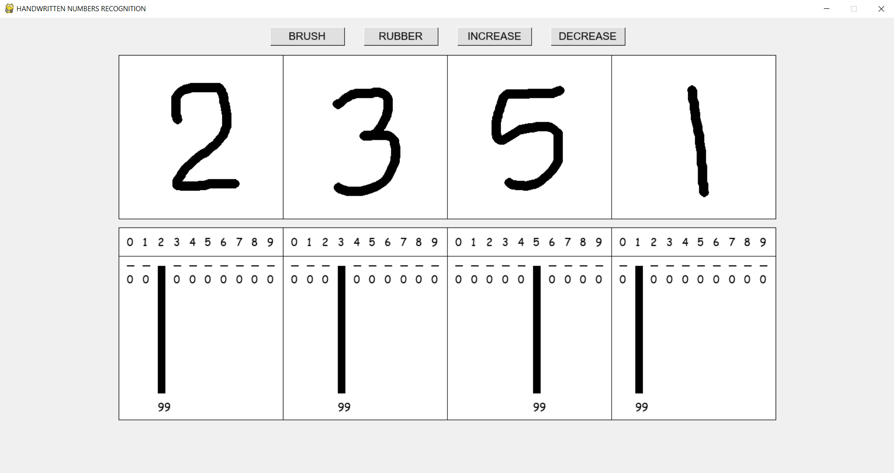
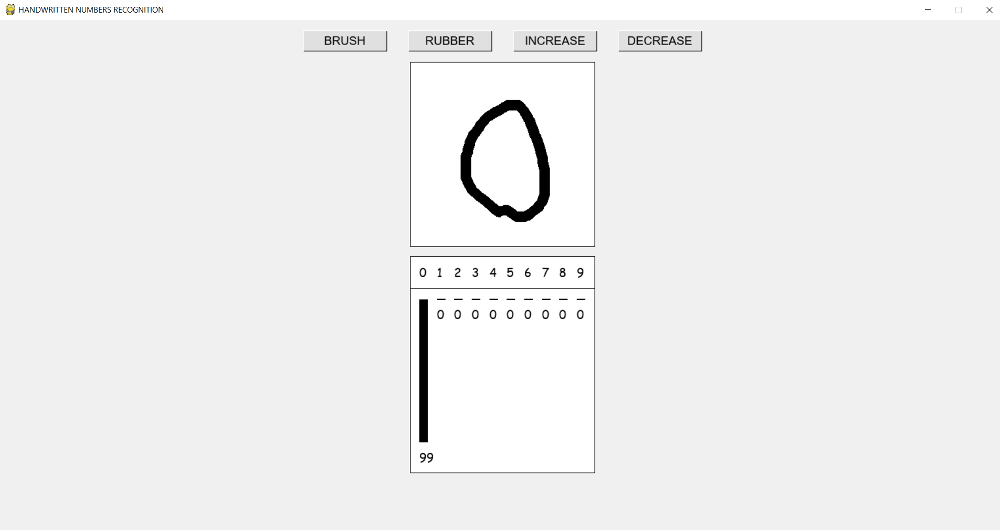
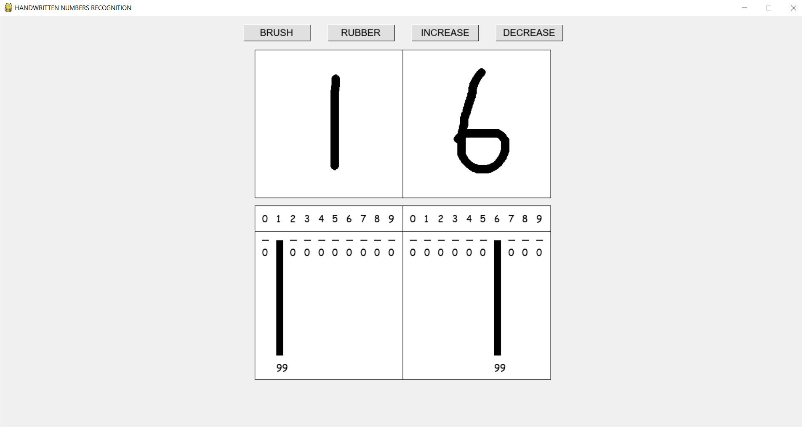
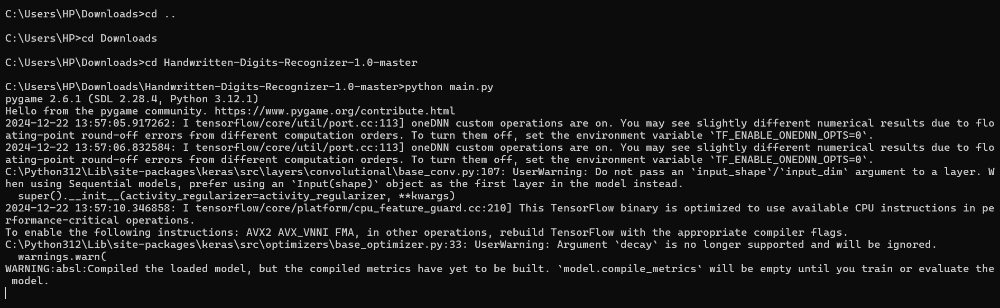
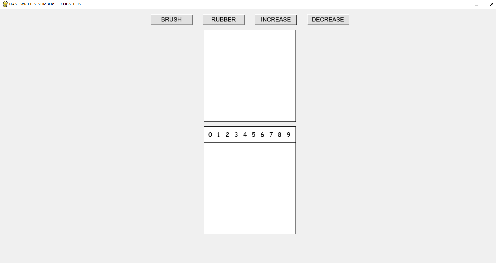
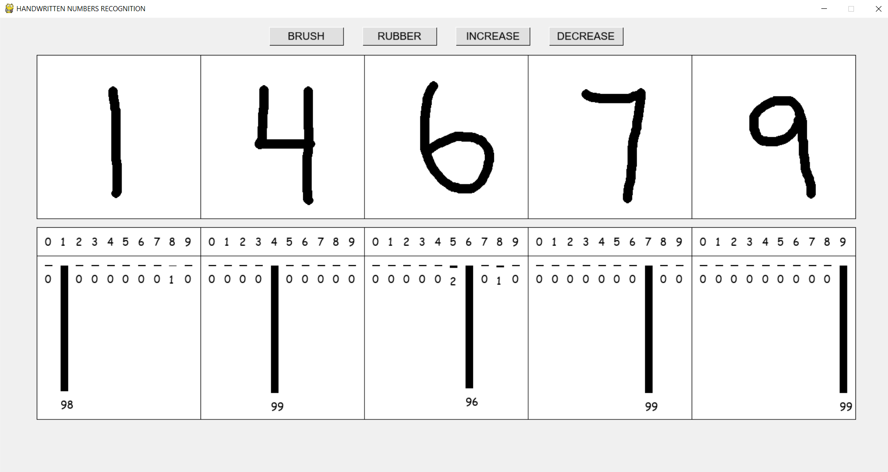

# Handwritten-Digits-Recognizer-1.0

Actually Mousewritten Digits Recognizer using CNN (Convolutional Neural Networks) in Python with Keras

This file includes the following chapters:
1. Code Requirements
2. Project description
3. How to install
4. Tips

# 1. Code Requirements:
Python 3.8 with following modules installed:
* Pygame 1.9
* NumPy
* TensorFlow 2.3
* Keras
* OpenCV 4.4 for Python
* Matplotlib

# 2. Project Description:
There are 4 buttons at the top of the window:
- brush and rubber, which are used for drawing,
- increase and decrease, which change number of input fields

After the drawing is finished, the recognition process starts automatically.
First input fields are converted into data for the neural network, which tries to recognize the digits labels.
Then probalities are shown below.
You can add or remove an input field whenever you want.

# 3. How to install:
If you're familiar with git you can clone the repo. Otherwise you can simply download whole project as a compressed folder.

Then you need to make sure your device meets the requirements in chapter 1 (appropriate libraries installed).
You can install them with pip from the command line.

Finally run the program using command line. Navigate to the directory, where the project is located and type python main.py

Wait a few second...
And you should see sth like that:

In the command line there may be some errors and warnings, but if you can use program and numbers are predicted correctly, then you can just ignore the erros.

If program doesn't work at all, read carefully the errors and try to find resolution on Stack Overflow or elsewhere. You should necessarily make an issue in the repo too.

# 4. Tips:
Digits recognition is not perfect. This is mainly due to the fact that the training data for the neural network is a popular set of MNIST handwritten digits. In our program, however, numbers are written with the mouse, so it can be difficult to keep the characters in the right shape. Keep special attention on 1, 4, 6, 7 and 9. Sample examples of the digits are provided below.

